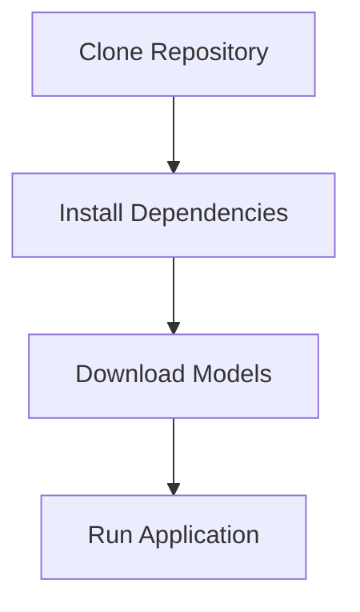

# Ncode v1.0.0

 <!-- Placeholder for banner image -->

[](LICENSE)
[](https://python.org)
[](https://github.com/facebookresearch/llama)

A powerful local code generation system using LLaMA models for planning and implementation.

## Table of Contents
- [Features](#features)
- [Installation](#installation)
- [Usage](#usage)
- [Architecture](#architecture)
- [Technical Details](#technical-details)
- [Screenshots](#screenshots)
- [Contributing](#contributing)
- [Acknowledgments](#acknowledgments)
- [License](#license)

## Features

| Feature | Description |
|---------|-------------|
| **Multi-Token Prediction (MTP)** | Experimental mode for faster generation |
| **Parallel Processing** | Simultaneous planning and code generation |
| **GPU Acceleration** | Automatic GPU layer optimization |
| **Model Flexibility** | Hot-swappable models for planning and coding |
| **Resource Optimization** | Dynamic context sizing and memory management |

 <!-- Placeholder for feature diagram -->

## Installation



1. Clone the repository:
```bash
git clone https://github.com/Shawn5cents/Ncode
cd Ncode
```

2. Install dependencies:
```bash
pip install -r requirements.txt
```

3. Download models to the `models/` directory:
```bash
# Planning Model
wget https://example.com/models/mistral-7b-instruct-v0.2.Q4_K_M.gguf -O models/mistral-7b-instruct-v0.2.Q4_K_M.gguf

# Coding Model
wget https://example.com/models/codellama-7b-instruct.Q4_K_M.gguf -O models/codellama-7b-instruct.Q4_K_M.gguf
```

## Usage

Start the CLI:
```bash
python backend/cli_client.py
```

### Commands

| Command | Description |
|---------|-------------|
| `mtp` | Toggle Multi-Token Prediction mode |
| `models` | List available models |
| `switch TYPE MODEL` | Change active model (TYPE: planning|coding) |
| `help` | Show help message |
| `quit` | Exit program |

### Examples

```bash
# Standard Mode
> create a hello world program in python
[Planning model generates architecture]
[Coding model implements solution]

# MTP Mode
> mtp
MTP is now enabled
> create a hello world program in python
[Single model generates combined solution]
```

## Screenshots

 <!-- Placeholder for CLI screenshot -->
 <!-- Placeholder for architecture diagram -->

## Architecture

- **LocalModelClient**: Core engine managing model operations
- **Parallel Generation**: Asynchronous planning and implementation
- **MTP Mode**: Experimental single-model generation
- **GPU Optimization**: Automatic layer configuration
- **Resource Management**: Dynamic context and cleanup

## Technical Details

- GPU memory-based optimization
- Thread-safe model loading
- Streaming token generation
- Proper resource cleanup
- Error handling with CPU fallback

## Contributing

See [CONTRIBUTING.md](CONTRIBUTING.md) for guidelines.

## Acknowledgments

### Special Thanks
- **michael5cents**: For inspiration and invaluable support throughout development
- **Louisce5cents**: For inspiration and crucial support in shaping the project

### Project Inspirations
- [Aider](https://github.com/paul-gauthier/aider): Inspiration for the architect mode and CLI interface
- [DeepSeek](https://github.com/deepseek-ai/DeepSeek-Coder): Inspiration for the Multi-Token Prediction (MTP) implementation

We thank these individuals and open-source projects for their innovative approaches and support that helped shape Ncode.

See [CREDITS.md](docs/CREDITS.md) for a complete list of acknowledgments.

## License

MIT License - see [LICENSE](LICENSE) for details.
